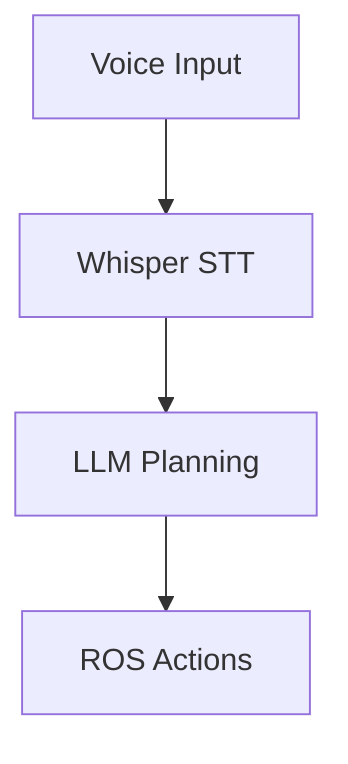

# Project Context: Physical AI & Humanoid Robotics Book

## Technology Stack

### Docusaurus
- **Framework**: React-based static site generator
- **Purpose**: Building the educational book/documentation site
- **Version**: 3.x (latest stable)

### Key Docusaurus Concepts
- **docs/**: Main content directory containing all module markdown files
- **src/**: Custom React components and pages
- **static/**: Images, diagrams, and static assets
- **sidebars.js**: Navigation structure and content organization
- **docusaurus.config.js**: Main configuration (site metadata, theme, plugins)

## Current Project Structure

```
humanoid-robotics-book/
├── .claude/
│   └── commands/              # Claude AI custom commands
├── specify/
│   ├── memory/               # AI memory and context
│   │   └── constitution.md   # Project constitution/guidelines
│   ├── scripts/              # Automation scripts
│   ├── templates/            # Content templates
│   ├── history/              # Project history tracking
│   └── specs/                # Specification documents
├── temp_docusaurus/          # Temporary Docusaurus workspace
├── docs/                     # Main content directory
│   ├── intro.md
│   ├── module-1-ros2/
│   ├── module-2-simulation/
│   ├── module-3-isaac/
│   └── module-4-vla/
├── src/
│   ├── components/           # Custom React components
│   └── pages/                # Custom pages (homepage, etc.)
├── static/
│   └── img/                  # Images organized by module
├── docusaurus.config.js      # Main Docusaurus configuration
├── sidebars.js               # Navigation structure
├── package.json              # Node.js dependencies
├── CLAUDE.md                 # Claude AI integration docs
├── project-context.md        # This file
├── .gitignore
├── sp.adr.md                 # Architecture Decision Records
├── sp.analyze.md             # Project analysis
├── sp.checklist.md           # Project checklist
├── sp.clarify.md             # Clarifications needed
├── sp.constitution.md        # Project constitution
├── sp.git.commit_pr.md       # Git commit guidelines
├── sp.implement.md           # Implementation guide
├── sp.phr.md                 # Project health report
├── sp.plan.md                # Project plan
├── sp.specify.md             # Project specifications
└── sp.tasks.md               # Task tracking
```

## Spec-Kit Plus Integration

This project uses **Spec-Kit Plus** for AI-driven development:

### Key Spec Files
- **sp.specify.md**: Project specifications (modules, learning outcomes, requirements)
- **sp.plan.md**: Implementation plan with phases and timelines
- **sp.tasks.md**: Task breakdown and tracking
- **sp.implement.md**: Implementation execution guide
- **sp.checklist.md**: Quality validation checklist
- **sp.constitution.md**: Project guidelines and principles

### Workflow
1. Define specs in `sp.specify.md`
2. Create plan in `sp.plan.md`
3. Break down tasks in `sp.tasks.md`
4. Execute with `sp.implement.md`
5. Validate with `sp.checklist.md`

## Docusaurus File Structure

### docs/ Organization
```
docs/
├── intro.md                  # Course introduction
├── foundations/              # Module 0 - Humanoid robotics basics
│   ├── overview.md
│   ├── what-is-humanoid-robotics.md
│   ├── core-subsystems.md
│   ├── modern-examples.md
│   └── future-trajectory.md
├── module-1-ros2/           # The Robotic Nervous System
│   ├── overview.md
│   ├── week-3-foundations.md
│   ├── week-4-sensors-tf.md
│   ├── week-5-control-ai.md
│   ├── assignments.md
│   └── capstone-nervous-system.md
├── module-2-simulation/     # The Digital Twin
│   ├── overview.md
│   ├── gazebo-setup.md
│   ├── unity-integration.md
│   ├── sensor-simulation.md
│   └── assignments.md
├── module-3-isaac/          # The AI-Robot Brain
│   ├── overview.md
│   ├── week-8-isaac-sim.md
│   ├── week-9-perception.md
│   ├── week-10-navigation.md
│   ├── assignments.md
│   └── capstone-perception-pipeline.md
├── module-4-vla/            # Vision-Language-Action
│   ├── overview.md
│   ├── week-11-speech.md
│   ├── week-12-llm-planning.md
│   ├── week-13-vision-integration.md
│   ├── assignments.md
│   └── final-capstone.md
├── hardware-guide/          # Hardware requirements
│   ├── workstation-specs.md
│   ├── edge-kits.md
│   ├── robot-options.md
│   └── cloud-vs-onpremise.md
└── appendix/
    ├── installation-guides.md
    ├── troubleshooting.md
    ├── glossary.md
    └── resources.md
```

### static/ Organization
```
static/
└── img/
    ├── module-1/            # ROS 2 diagrams
    ├── module-2/            # Simulation screenshots
    ├── module-3/            # Isaac Sim visuals
    ├── module-4/            # VLA pipeline diagrams
    ├── hardware/            # Hardware photos/diagrams
    └── logos/               # Branding assets
```

## Docusaurus Commands

```bash
# Development
npm start                    # Start dev server (localhost:3000)

# Building
npm run build               # Build static site → /build directory

# Testing
npm run serve               # Preview built site locally

# Deployment
npm run deploy              # Deploy to GitHub Pages (gh-pages branch)
```

## Content Format Rules

### Markdown Files
- Use `.md` or `.mdx` (Markdown + JSX)
- Maximum 2000 words per page
- Code blocks limited to 50 lines
- Consistent heading hierarchy (H1 → H2 → H3)

### Frontmatter Template
```yaml
---
sidebar_position: 1
title: "Module Title"
description: "Brief description"
keywords: [ros2, robotics, ai]
---
```

### Code Blocks
```python
# Python example with syntax highlighting
import rclpy
from rclpy.node import Node
```

### Mermaid Diagrams


### Images
```markdown

```

## Deployment Configuration

### GitHub Pages Setup
- **Target Branch**: `gh-pages`
- **Base URL**: `/Humanoid-robotics-book/`
- **Organization**: irza16
- **Deployment Method**: `npm run deploy`

### Required Configuration
In `docusaurus.config.js`:
```javascript
url: 'https://github.com/irza16',
baseUrl: '/Humanoid-robotics-book/',
organizationName: 'irza16',
projectName: 'humanoid-robotics-book',
deploymentBranch: 'gh-pages',
```

## Project Modules

### Module 0: Foundations
- What makes a robot "humanoid"
- Core subsystems overview
- Modern examples (Tesla Optimus, Atlas, etc.)

### Module 1: ROS 2 Nervous System
- ROS 2 architecture and nodes
- URDF robot descriptions
- Sensor integration and TF2 transforms

### Module 2: Digital Twin (Simulation)
- Gazebo physics simulation
- Unity high-fidelity rendering
- Sensor simulation (LiDAR, depth cameras)

### Module 3: Isaac AI Brain
- NVIDIA Isaac Sim for training
- Isaac ROS for perception
- Nav2 navigation for bipedal robots

### Module 4: Vision-Language-Action
- OpenAI Whisper for voice commands
- LLM-based cognitive planning
- Multimodal robot control

## AI Assistant Context

### When Helping with Content
- Follow module specifications in `sp.specify.md`
- Check `sp.plan.md` for phase and timeline
- Reference `sp.tasks.md` for current priorities
- Validate against `sp.checklist.md`

### Content Guidelines
- Beginner-friendly tone
- Progressive complexity (basic → advanced)
- Real-world examples from modern robots
- Practical code examples with explanations
- Clear learning outcomes per section

### Technical Requirements
- ROS 2 Humble/Iron
- Ubuntu 22.04 LTS
- Python 3.10+
- NVIDIA RTX GPU for Isaac Sim
- Jetson Orin for edge deployment

## Project Goals

1. **Educational Excellence**: Create comprehensive learning resource
2. **Practical Focus**: Hands-on examples and projects
3. **Modern Stack**: Latest tools (Isaac Sim, GPT-4, ROS 2)
4. **Accessibility**: Simulation-first approach for all budgets
5. **Deployment Ready**: Production-quality Docusaurus site

## Quality Standards

- Zero broken links
- All code examples tested and valid
- Mobile-responsive design
- Lighthouse score > 90
- Consistent formatting across modules
- Clear progression from beginner to advanced

## Target Audience

- Hackathon participants
- Robotics students (undergraduate/graduate)
- AI developers transitioning to embodied AI
- Self-learners exploring Physical AI

## Success Metrics

- All 4 modules complete with weekly breakdowns
- 20+ working code examples
- 10+ Mermaid diagrams
- Complete hardware guide (3 budget tiers)
- Installation and troubleshooting guides
- Successfully deployed to GitHub Pages